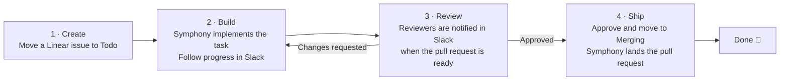

# Orchestrators

Run a fleet of [Symphony](https://github.com/openai/symphony) instances and keep
their work moving from Slack.

Orchestrators gives every project an isolated Symphony instance, then brings
their tasks, pull requests, and Linear workflows into one Slack channel. You can
see what needs attention and respond without opening each Symphony dashboard.

## What it does

- **See every task at a glance.** Live Slack cards surface current activity,
  status changes, pull requests, blockers, and completed work. Each task keeps
  its full conversation in one thread.
- **Keep work moving from Slack.** Change Linear status, choose who should be
  notified, and send instructions or images from the task thread straight to
  Symphony's Linear workpad.
- **Turn an existing pull request into agent work.** Share an open GitHub pull
  request in Slack and Orchestrators creates the Linear task that hands it to
  Symphony.
- **Close the review loop automatically.** Eligible inline review comments and
  merge conflicts send work back to Symphony, while the right people are
  notified when a new revision is ready to review.

## How it works

Each Linear issue becomes a task that Symphony works on and Orchestrators
tracks in Slack. The default `customize` workflow follows four steps:

During review, an eligible inline review comment or merge conflict automatically
moves the issue back to In Progress. You can also reply with instructions or
images in the Slack task thread and change its status there. When the next
revision is ready, Orchestrators notifies the assigned reviewers again.

See [Architecture](docs/architecture.md#review-requeue-lifecycle) for
polling, comment handling, persistence, and recovery details.

## Get started

Follow [`SETUP.md`](SETUP.md) to install the requirements, connect Slack and
Linear, create a Symphony instance, and start Orchestrators.

## Documentation

- [`SETUP.md`](SETUP.md) — installation and initial configuration
- [`watcher/README.md`](watcher/README.md) — Slack commands, watcher behavior,
  and optional configuration
- [`docs/workflows.md`](docs/workflows.md) — Symphony workflow profiles and
  per-instance configuration
- [`docs/architecture.md`](docs/architecture.md) — data flow, polling
  boundaries, and the review-requeue lifecycle
