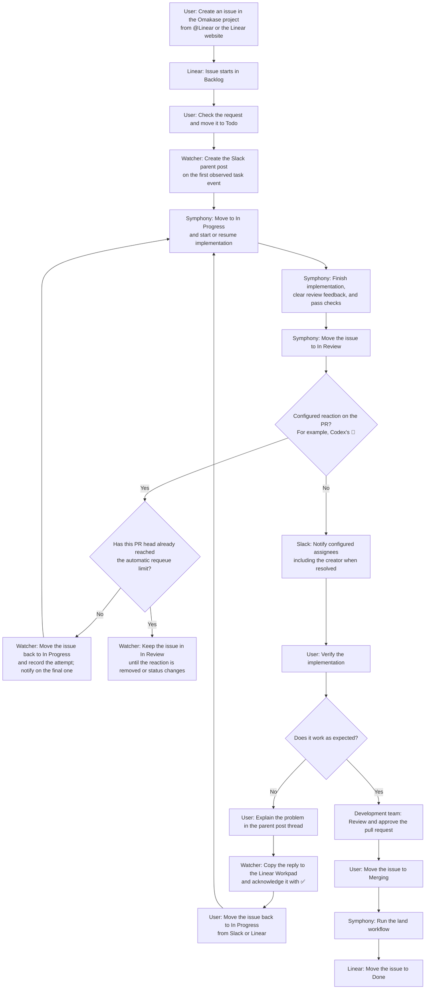

# Orchestrators

Run a fleet of [Symphony](https://github.com/openai/symphony) instances and keep
their work moving from Slack.

Orchestrators gives every project an isolated Symphony instance, then brings
their tasks, pull requests, and Linear workflows into one Slack channel. You can
see what needs attention and respond without opening each Symphony dashboard.


## What it does

- **One control plane for every project.** Run multiple isolated Symphony
  instances with a single command, while keeping each project's workflow,
  workspace, and logs separate.
- **A live task inbox in Slack.** Follow state changes, pull requests, blockers,
  and completed work across every instance from one channel, with a dedicated
  thread for each task.
- **Operate Linear without leaving the conversation.** Change issue status,
  manage task assignees, turn an existing open pull request into tracked Linear
  work, and send replies and images from a Slack thread back to the Linear
  workpad.
- **Automated review loops keep moving.** When a configured review reaction
  (for example, Codex's 👀) appears on a linked pull request, Orchestrators
  requeues the Linear issue so Symphony can act on the feedback.

## How it works

The default `customize` workflow follows this cycle:



## Requirements

- Node.js 24+
- pnpm 11+
- Elixir 1.19 and Erlang 28 available on `PATH`
- Authenticated GitHub CLI (`gh auth status`)

Official Symphony recommends `mise` for managing Elixir/Erlang versions, and
the setup guide uses it.

## Run

Follow [`SETUP.md`](SETUP.md) to configure Slack and Linear, create a Symphony
instance, and verify the complete setup. Then start the enabled instances:

```sh
pnpm start:symphonies
```

In another terminal, start the Slack watcher:

```sh
pnpm start:watcher
```

## Documentation

- [`SETUP.md`](SETUP.md) — installation and initial configuration
- [`watcher/README.md`](watcher/README.md) — Slack commands, watcher behavior,
  and optional configuration
- [`docs/workflows.md`](docs/workflows.md) — Symphony workflow profiles and
  per-instance configuration
- [`docs/architecture.md`](docs/architecture.md) — data flow, polling
  boundaries, and the review-reaction lifecycle
