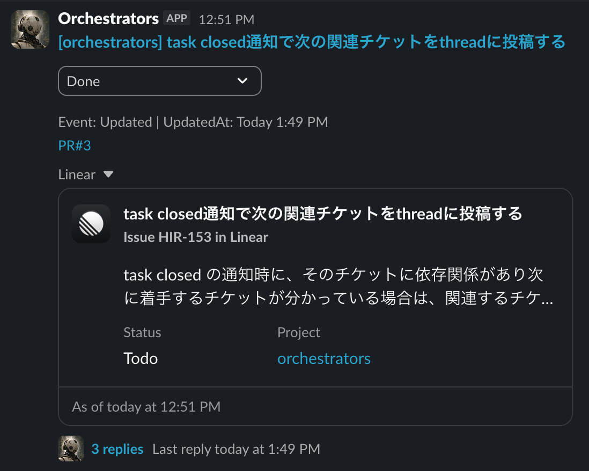

# Orchestrators

[Symphony](https://github.com/openai/symphony) is a powerful orchestrator, but
managing it outside its dashboard can be difficult. Orchestrators runs one
Symphony instance per project, brings notifications from every instance into
Slack, and makes it easy to update Linear issue statuses. This lets you
efficiently keep many tasks moving, even while away from your desk.



## What it does

- Monitor tasks across all your Symphony projects from one Slack channel
- Get notified when tasks change state, open pull requests, become blocked, or
  finish
- Update Linear issue statuses directly from Slack
- Keep work moving during automated code review by requeuing Linear issues when
  a configured emoji reaction (for example, Codex's 👀) appears on a linked
  pull request
- Run multiple isolated Symphony instances with one command while keeping each
  project's workspace and logs separate

Generated instances, runtime data, and private configuration are gitignored.

## Requirements

- Node.js 24+
- pnpm 11+
- Elixir 1.19 and Erlang 28 available on `PATH`
- Authenticated GitHub CLI (`gh auth status`)

Official Symphony recommends `mise` for managing Elixir/Erlang versions, and
the setup commands below use it.

## Setup

<details>
<summary>1. Set up the watcher</summary>

During setup, you will configure the following values:

- `SLACK_BOT_TOKEN` — Slack bot token (`xoxb-...`)
- `SLACK_APP_TOKEN` — Slack app-level token (`xapp-...`)
- `SLACK_CHANNEL_ID` — destination Slack channel ID
- `LINEAR_API_KEY_PROJECT` — Linear API key
- `LINEAR_TEAM_ID_PROJECT` — Linear team ID
- `<instance-name>` — local Symphony instance name
- `<team-key>` — key used for the Linear team
- `<workspace>` — Linear workspace slug

### Install

```sh
npm run setup
pnpm install
cp watcher/config.example.ts watcher/config.ts
```

### Configuration

`watcher/config.ts` is gitignored. Credentials can also be read from environment
variables as shown in `watcher/config.example.ts`.

#### Create the Slack app

Create the app from [`watcher/slack-manifest.json`](watcher/slack-manifest.json),
install it to the workspace, and invite its bot to the destination channel. The
manifest enables Socket Mode and interactivity. It grants only the bot scopes
used by the watcher:

- `chat:write` — post and update task messages
- `channels:history` / `groups:history` — receive user replies in public or
  private task threads
- `reactions:write` — acknowledge successfully copied replies with a check mark
- `users:read` — resolve the display name of a user who changes a status

For an existing Slack app, apply the updated manifest in **App Manifest**,
save it, and reinstall the app to the workspace so the new event subscriptions
and history scopes are authorized before restarting the watcher.

The manifest cannot issue an app-level token. In **Basic Information →
App-Level Tokens**, choose **Generate Token and Scopes**, add
`connections:write`, and copy the resulting `xapp-...` token to
`slack.appToken` in `watcher/config.ts`. Copy the installed bot's `xoxb-...`
token to `slack.botToken`.

#### Define teams and instances

Declare Linear credentials as named teams, then reference one team from every
instance:

```ts
export default defineConfig({
  slack: {
    botToken: process.env.SLACK_BOT_TOKEN ?? "", // xoxb-...
    appToken: process.env.SLACK_APP_TOKEN ?? "", // xapp-...
    channelId: process.env.SLACK_CHANNEL_ID ?? "",
  },
  linearTeams: {
    "<team-key>": {
      apiKey: process.env.LINEAR_API_KEY_PROJECT ?? "",
      teamId: process.env.LINEAR_TEAM_ID_PROJECT ?? "",
      baseUrl: "https://linear.app/<workspace>/issue",
    },
  },
  instances: {
    "<instance-name>": {
      enabled: true,
      port: 4105,
      linearTeam: "<team-key>",
    },
  },
});
```

See [`watcher/README.md`](watcher/README.md) for runtime behavior and optional
configuration.

</details>

<details>
<summary>2. Set up a Symphony instance</summary>

Run the following commands from the repository root.

During setup, you will configure the following values:

- `<instance-name>` — local Symphony instance name
- `<repository-url>` — repository cloned into each issue workspace
- `<linear-project-slug>` — Linear project slug

Create and configure Symphony:

```sh
./scripts/setup-symphony.sh "<instance-name>"
```

The setup command asks which workflow profile to use:

- `customize` (default) — applies the repository's Japanese Linear, pull request, review
  quiet-window, and Docker cleanup conventions
- `official` — copies the upstream Symphony workflow unchanged

For non-interactive setup, pass the profile explicitly:

```sh
./scripts/setup-symphony.sh "<instance-name>" official
./scripts/setup-symphony.sh "<instance-name>" customize
```

The `customize` profile is maintained separately in
[`overlays/customize/workflow.patch`](overlays/customize/workflow.patch), keeping
the `symphony_template/` Git subtree identical to upstream.

The watcher example configuration uses `In Review`, matching the default
`customize` profile. The `official` profile uses Symphony's upstream
`Human Review` status; when selecting it, set `watcher.reviewReaction.inReviewStatus`
and any matching `slack.mention.statuses` entries to `Human Review`.

Edit `symphonies/<instance-name>/elixir/WORKFLOW.md`. Each instance has its own
workflow and can customize it independently. Since `symphonies/` is gitignored,
these changes stay local to the instance. At minimum, set:

```yaml
---
tracker:
  kind: linear
  provider:
    project_slug: "<linear-project-slug>"
  required_labels: []
  active_states:
    - Todo
    - In Progress
  terminal_states:
    - Done
    - Canceled
polling:
  interval_ms: 5000
workspace:
  root: ../../../data/symphony/workspaces/<instance-name>
hooks:
  after_create: |
    git clone --depth 1 <repository-url> .
agent:
  max_concurrent_agents: 10
  max_turns: 20
---
```

`WORKFLOW.md` contains the Linear states and repository-specific workflow for
that instance. The `workspace.root` path is relative to the instance's `elixir/`
directory.

Build the copied instance:

```sh
cd "symphonies/<instance-name>/elixir"
mise trust
mise install
mise exec -- mix setup
mise exec -- mix build
cd ../../..
```

If the Symphony runner or Slack watcher is already running, restart both
processes after adding or changing an instance. Configuration is loaded at
startup.

</details>

## Run

Run the enabled Symphony instances from the repository root:

```sh
pnpm start:symphonies
```

Each instance's dashboard is available at `http://127.0.0.1:<port>`, using the
port configured in `watcher/config.ts`. Logs are written to
`data/symphony/logs/<instance-name>/`.

To also monitor the instances from Slack, start the watcher in another terminal:

```sh
pnpm start:watcher
```

## Update Symphony

Pull the latest `openai/symphony` `main` branch into `symphony_template/`:

```sh
./scripts/update-symphony.sh
```

This does not update instances already copied to `symphonies/`.

## Repository layout

- `symphony_template/` — official Symphony source imported as a Git subtree and copied into each instance
- `symphonies/<name>/` — generated local instances
- `watcher/` — process runner and Slack watcher
- `data/symphony/` — instance workspaces and logs
- `data/watcher/` — watcher SQLite state
