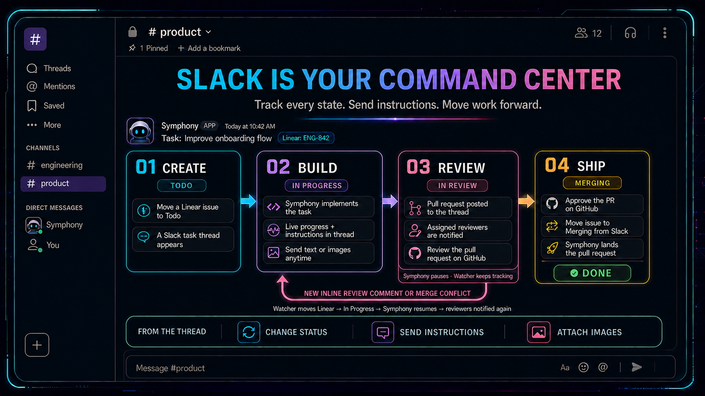
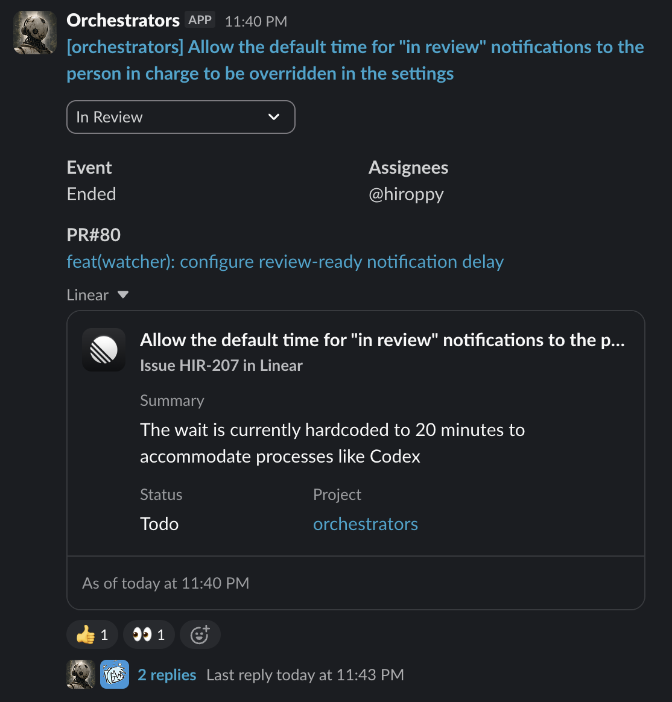
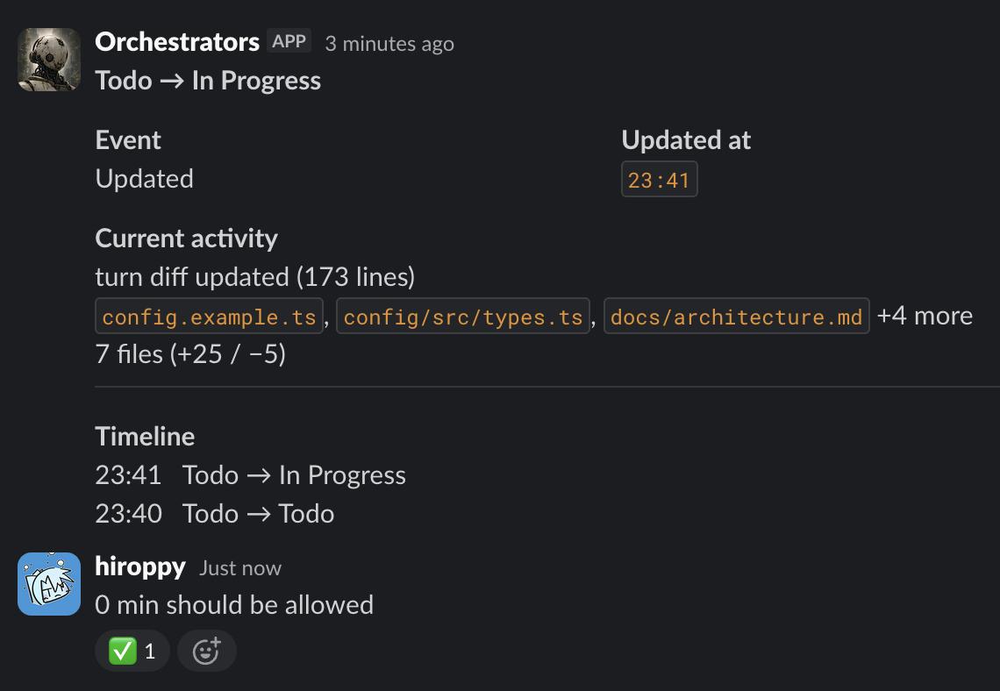

# Orchestrators

Run a fleet of [Symphony](https://github.com/openai/symphony) instances and keep
their work moving from Slack.

When multiple agents, Linear issues, and GitHub pull requests move at once,
review status, follow-up requests, and rework can easily scatter across tools.
Orchestrators gives every project an isolated Symphony instance, then brings
their tasks, pull requests, and Linear workflows into one Slack channel. You can
see what needs attention and respond without opening each Symphony dashboard.

## What it does

- **See every task at a glance.** Live Slack cards surface current activity,
  status changes, pull requests, blockers, and completed work. Each task keeps
  its full conversation in one thread.
- **Keep work moving from Slack.** Change Linear status, choose who should be
  notified, and send instructions or images from the task thread straight to
  Symphony's Linear workpad.
- **Start from Linear or an existing PR.** Planned work begins from Linear, and
  `take-pr` turns an open GitHub pull request into a Linear task Symphony can
  pick up.
- **Keep follow-up context close to the task.** Slack thread replies and
  supported attachments are copied into Symphony's Linear workpad, while the
  thread keeps status history and review notifications together.
- **Close the review loop automatically.** Eligible inline review comments and
  merge conflicts send work back to Symphony, while the right people are
  notified when a new revision is ready to review.

## How it works

Orchestrators can start from a planned Linear issue or from an existing pull
request. Both paths become the same tracked task in Slack, then follow the
same build, review, and requeue loop.

Slack keeps the live task post and follow-up thread together: the post shows the
current state and actions, while the thread keeps status history and operator
follow-ups in one place.

| Post                                                                                                                            | Thread                                                                                                 |
| ------------------------------------------------------------------------------------------------------------------------------- | ------------------------------------------------------------------------------------------------------ |
|  |  |

### Starting from Linear

1. A Symphony instance claims an eligible Linear issue from the active states
   in that service's `WORKFLOW.md`.
2. Orchestrators polls Symphony's local observability API, sees the new active
   task, and enriches it with authoritative Linear state and GitHub pull
   request metadata when a PR is linked.
3. The watcher creates one Slack card and thread for the task. The card updates
   in place with the current Linear status, Symphony activity, changed files,
   and the linked pull request when available.
4. Slack replies in the task thread are copied to Symphony's active Linear
   workpad, so operators can add instructions or images without leaving Slack.

### Starting from an Existing PR

1. Run `@bot take-pr <GitHub PR URL>` in the watcher Slack channel.
2. Orchestrators verifies that the GitHub pull request is accessible and open,
   asks which configured service should own it, and infers the matching service
   when the repository name matches.
3. After confirmation, Orchestrators creates a `Todo` Linear issue in the
   service's configured Linear project. The issue description includes the PR,
   the PR description, the Slack request link, and an initial instruction to add
   the Linear issue reference to the existing PR.
4. The new Linear issue is assigned to the requesting Slack user and default
   assignees when configured. From there, Symphony can claim it like any other
   Linear-started task.

### Review Loop

The default `customize` workflow moves work through implementation, review,
feedback, and completion:

1. While Symphony is working, Orchestrators keeps the Slack card fresh with the
   latest activity and changed-file summary.
2. If you need to add follow-up instructions, reply in the Slack task thread.
   Orchestrators copies the text and supported attachments into Symphony's
   active Linear workpad, then reacts to the Slack reply after the copy
   succeeds.
3. When Symphony opens or updates a pull request and moves the Linear issue to
   review, Orchestrators keeps tracking the task even after it leaves
   Symphony's active work set.
4. If the pull request gets an eligible inline review comment or GitHub reports
   a merge conflict, Orchestrators automatically moves the Linear issue back to
   In Progress so Symphony can pick it up again.
5. When the next revision is ready, Orchestrators notifies the assigned
   reviewers again. You can also change Linear status directly from the Slack
   card whenever manual intervention is needed.

Optionally, the watcher can move the Linear issue to a configured status when
its pull request closes without merging. Merged pull requests remain under
Linear's GitHub workflow automation.

See [Architecture](docs/architecture.md#review-requeue-lifecycle) for
polling, comment handling, persistence, and recovery details.

## Get started

Follow [`SETUP.md`](SETUP.md) to install the requirements, connect Slack and
Linear, create a Symphony instance, and start Orchestrators.

## Documentation

- [`SETUP.md`](SETUP.md) — installation and initial configuration
- [`watcher/README.md`](watcher/README.md) — Slack commands, watcher behavior,
  and optional configuration
- [`docs/workflows.md`](docs/workflows.md) — Symphony workflow profiles and
  per-instance configuration
- [`docs/architecture.md`](docs/architecture.md) — data flow, polling
  boundaries, and the review-requeue lifecycle
