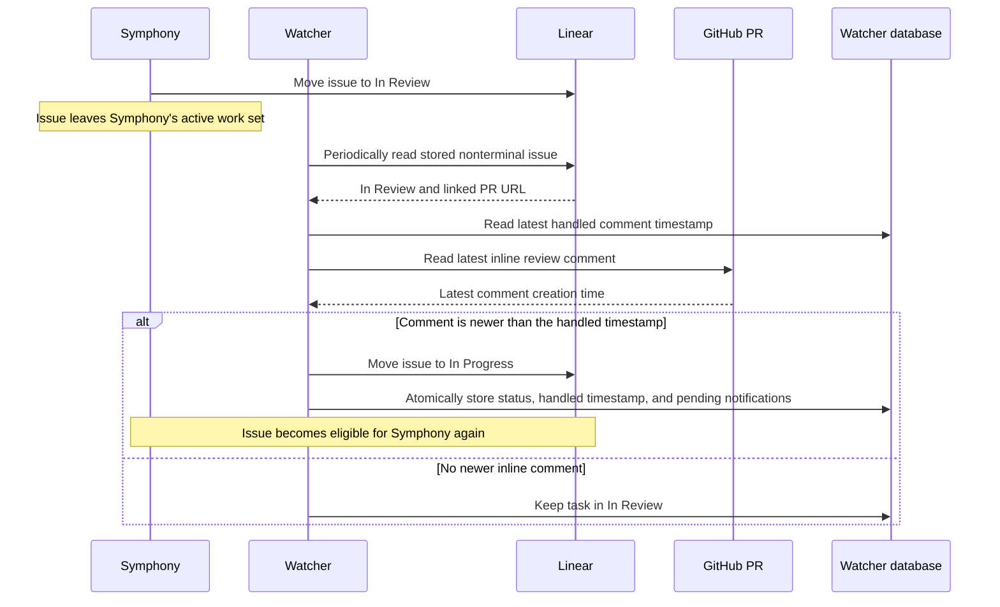

# Architecture

Orchestrators consists of two long-running processes with different responsibilities:

- The Symphony runner starts and supervises one Symphony instance per enabled project.
- The watcher observes Symphony, reconciles tracked work with Linear and GitHub, and presents the
  resulting state in Slack.

The important distinction is that a task can leave Symphony's active work set while remaining a
nonterminal task tracked by the watcher. Inline-comment handling depends on this distinction.

## System overview


The watcher uses polling for Symphony, Linear, and GitHub. Slack interactions arrive through Socket
Mode. GitHub comments are not received through a webhook.

## Two tracking layers

### Symphony active work

Each Symphony instance selects issues using the active states in its `WORKFLOW.md`. The watcher
polls the instance's `/api/v1/state` observability endpoint every three seconds and compares the
response with its previous snapshot.

A snapshot difference emits a watcher event when a task appears, changes execution state, becomes
blocked or retrying, or disappears. The watcher then enriches that event with authoritative Linear
state and, when relevant, GitHub pull-request metadata.

### Watcher tracked tasks

Once a task has been published to Slack, the watcher keeps it in its database. Leaving Symphony's
active snapshot does not delete that record. During periodic maintenance, approximately every 30
seconds, the watcher reconciles stored tasks whose effective Linear state type is nonterminal.

This allows the watcher to continue tracking states such as `In Review`, even when those states are
not part of Symphony's active work set. By default, tasks whose Linear state type is `completed`,
`canceled`, or `duplicate` are excluded from later reconciliation. A configured
`watcher.statusTypeOverrides` entry replaces that classification inside the watcher, so it can
promote a status to terminal or demote one back to nonterminal without changing Linear. The same
effective type controls Slack status summaries, closure announcements, and related follow-up issue
filtering. If an immediate Slack status-action reconciliation cannot confirm or publish a terminal
state, the event log keeps that task eligible for periodic reconciliation until publication
succeeds. This retry marker preserves the pre-transition classification so terminal-to-terminal
actions do not produce a false closure announcement. Each newer Slack action supersedes the prior
marker, and reconciliation rechecks that marker after entering the task queue so stale Linear reads
cannot overwrite a newer action. The marker completes after the task card and closure announcement
publish successfully; a later thread-message failure therefore does not repeat the closure.

## Polling and API calls

| Trigger              |                   Typical interval | External work                                                                 |
| -------------------- | ---------------------------------: | ----------------------------------------------------------------------------- |
| Symphony observation |                          3 seconds | Reads each enabled instance's local observability API                         |
| Snapshot change      | Event-driven after a 3-second poll | Reads Linear; may query the task's PR                                         |
| Periodic maintenance |                         30 seconds | Reconciles stored nonterminal tasks with Linear; may query review PR comments |
| Slack interaction    |                       Event-driven | May update Linear and then the Slack task card                                |

The three-second loop does not unconditionally call GitHub for every task. A GitHub query is made
when event enrichment requires PR data, or when periodic reconciliation finds a task in the
configured review status. Review-status tasks remain eligible for this 30-second reconciliation
even while they are present in an unchanged Symphony snapshot. GitHub access is performed through
`gh pr view` and `gh api`.

At startup, the watcher loads each enabled Linear team's workflow states for configuration
validation and caches their name-to-ID mappings for one hour. Manual Slack status changes resolve
the issue and its team's current states before mutating. Automated review requeues instead reuse
both the issue UUID obtained during event enrichment and the cached target state ID, so their normal
path sends only the update mutation. Cache expiration is lazy: it does not cause an hourly request,
but the next automated requeue resolves current state metadata through the uncached path. A
transient cached mutation failure leaves the cache intact. A non-transient failure invalidates the
team's cache and returns the original error without an immediate retry; a later poll then resolves
current state metadata through the uncached path.

## Inline-review-comment lifecycle

Given this configuration:

```ts
reviewComment: {
  inReviewStatus: "In Review",
  inProgressStatus: "In Progress",
  symphonyGitHubLogins: ["your-symphony-account"],
}
```

the normal lifecycle is:

The watcher excludes comments from the pull request author and configured
`symphonyGitHubLogins` before selecting the latest eligible comment.



The decision compares the latest comment in a current, unresolved GitHub review thread with the
last handled comment timestamp in `task_events`. Comments in resolved or outdated threads are
ignored, including comments added after resolution. A resolved thread becomes eligible again only
if it is marked unresolved and is not outdated. This catches comments that arrive between Linear
entering `In Review` and the watcher's next poll, while an already handled comment cannot requeue
the task again. Comment IDs are not persisted.

The watcher runs as a single process. After Linear accepts the status update, the local status,
handled timestamp, and pending notifications are stored together. A process exit between the Linear
update and that local transaction can cause the same comment to be considered again after the task
returns to review; this recovery gap is accepted to keep the internal tool simple.

The review-comment cursor intentionally remains timestamp-only: comments with the same GitHub
`createdAt` value are treated as one feedback boundary, and the watcher examines at most the first
100 review threads returned by GitHub. On a task without a handled cursor, the first current,
unresolved comment may trigger a requeue even if it predates the current review cycle. These limits
avoid comment-ID lifecycle tracking, pagination machinery, and per-review baseline state in this
single-watcher internal deployment.

## Persistence and recovery

The watcher database stores:

- the latest Symphony snapshots used for diffing;
- tracked tasks and their current known Linear status;
- Slack parent-message identifiers;
- watcher events and review-comment requeues;
- pending delivery state for recoverable Slack notifications.

The database is why review tracking and delivery retries can continue after a watcher restart. If
the watcher is stopped, no polling or review-comment handling occurs; reconciliation resumes after it
starts again.

## Implementation map

- `watcher/src/watcher/runner.ts` owns the three-second loop and 30-second maintenance schedule.
- `watcher/src/watcher/snapshots.ts` collects Symphony observability snapshots.
- `watcher/src/watcher/diff.ts` converts snapshot changes into watcher events.
- `watcher/src/watcher/event-enrichment.ts` resolves Linear state and PR metadata.
- `watcher/src/watcher/review-comments.ts` decides whether a new inline comment should requeue a task.
- `watcher/src/watcher/review-requeue.ts` updates Linear and persists the requeue result.
- `watcher/src/integrations/github.ts` reads PRs and inline review comments through the GitHub CLI.
- `watcher/src/persistence/store.ts` stores snapshots, tasks, and the event audit trail.
