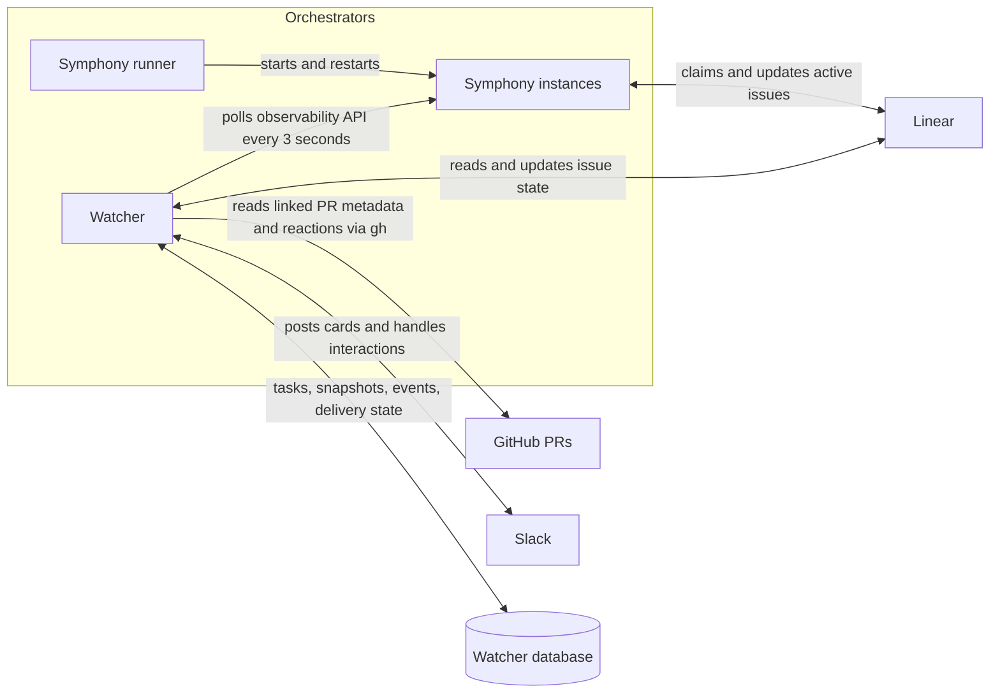
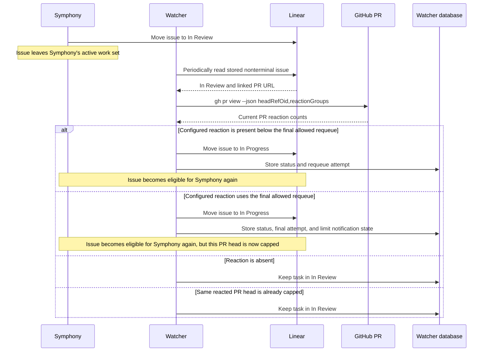

# Architecture

Orchestrators consists of two long-running processes with different responsibilities:

- The Symphony runner starts and supervises one Symphony instance per enabled project.
- The watcher observes Symphony, reconciles tracked work with Linear and GitHub, and presents the
  resulting state in Slack.

The important distinction is that a task can leave Symphony's active work set while remaining a
nonterminal task tracked by the watcher. Review-reaction handling depends on this distinction.

## System overview



The watcher uses polling for Symphony, Linear, and GitHub. Slack interactions arrive through Socket
Mode. GitHub reactions are not received through a webhook.

## Two tracking layers

### Symphony active work

Each Symphony instance selects issues using the active states in its `WORKFLOW.md`. The watcher
polls the instance's `/api/v1/state` observability endpoint every three seconds and compares the
response with its previous snapshot.

A snapshot difference emits a watcher event when a task appears, changes execution state, becomes
blocked or retrying, or disappears. The watcher then enriches that event with authoritative Linear
state and, when relevant, GitHub pull-request metadata.

### Watcher tracked tasks

Once a task has been published to Slack, the watcher keeps it in its database. Leaving Symphony's
active snapshot does not delete that record. During periodic maintenance, approximately every 30
seconds, the watcher reconciles stored tasks whose effective Linear state type is nonterminal.

This allows the watcher to continue tracking states such as `In Review`, even when those states are
not part of Symphony's active work set. By default, tasks whose Linear state type is `completed`,
`canceled`, or `duplicate` are excluded from later reconciliation. A configured
`watcher.statusTypeOverrides` entry replaces that classification inside the watcher, so it can
promote a status to terminal or demote one back to nonterminal without changing Linear. The same
effective type controls Slack status summaries, closure announcements, and related follow-up issue
filtering.

## Polling and API calls

| Trigger              |                   Typical interval | External work                                                                  |
| -------------------- | ---------------------------------: | ------------------------------------------------------------------------------ |
| Symphony observation |                          3 seconds | Reads each enabled instance's local observability API                          |
| Snapshot change      | Event-driven after a 3-second poll | Reads Linear; may query the task's PR                                          |
| Periodic maintenance |                         30 seconds | Reconciles stored nonterminal tasks with Linear; may query review PR reactions |
| Slack interaction    |                       Event-driven | May update Linear and then the Slack task card                                 |

The three-second loop does not unconditionally call GitHub for every task. A GitHub query is made
when event enrichment requires PR data, or when periodic reconciliation finds a task in the
configured review status. GitHub access is performed through `gh pr view`, which in turn uses the
GitHub API.

At startup, the watcher loads each enabled Linear team's workflow states for configuration
validation and caches their name-to-ID mappings for one hour. Manual Slack status changes resolve
the issue and its team's current states before mutating. Automated review requeues instead reuse
both the issue UUID obtained during event enrichment and the cached target state ID, so their normal
path sends only the update mutation. Cache expiration is lazy: it does not cause an hourly request,
but the next automated requeue resolves current state metadata through the uncached path. A
transient cached mutation failure leaves the cache intact. A non-transient failure invalidates the
team's cache and returns the original error without an immediate retry; a later poll then resolves
current state metadata through the uncached path.

## Review-reaction lifecycle

Given this configuration:

```ts
reviewReaction: {
  inReviewStatus: "In Review",
  inProgressStatus: "In Progress",
  reaction: "👀",
  maxRequeues: 3,
}
```

the normal lifecycle is:



The decision uses the current reaction count on the PR itself. It does not inspect when the reaction
was added or require it to be newer than the transition into `In Review`. Consequently, a reaction
added many hours after review began can move the issue back to `In Progress` on the next periodic
reconciliation.

Requeue attempts are counted per issue, PR URL, PR head commit, and configured reaction. The count
is persisted across watcher restarts. A new PR head commit receives a fresh allowance; the same
reacted head remains capped after `maxRequeues` attempts.

## Persistence and recovery

The watcher database stores:

- the latest Symphony snapshots used for diffing;
- tracked tasks and their current known Linear status;
- Slack parent-message identifiers;
- watcher events and review-requeue attempts;
- pending delivery and reconciliation state for recoverable operations.

The database is why review tracking and delivery retries can continue after a watcher restart. If
the watcher is stopped, no polling or reaction handling occurs; reconciliation resumes after it
starts again.

## Implementation map

- `watcher/src/watcher/runner.ts` owns the three-second loop and 30-second maintenance schedule.
- `watcher/src/watcher/snapshots.ts` collects Symphony observability snapshots.
- `watcher/src/watcher/diff.ts` converts snapshot changes into watcher events.
- `watcher/src/watcher/event-enrichment.ts` resolves Linear state and PR metadata.
- `watcher/src/watcher/review-reactions.ts` decides whether a reaction should requeue a task.
- `watcher/src/watcher/review-requeue.ts` updates Linear and persists the requeue result.
- `watcher/src/integrations/github.ts` reads PRs and reaction groups through the GitHub CLI.
- `watcher/src/persistence/store.ts` stores snapshots, tasks, and the event audit trail.
