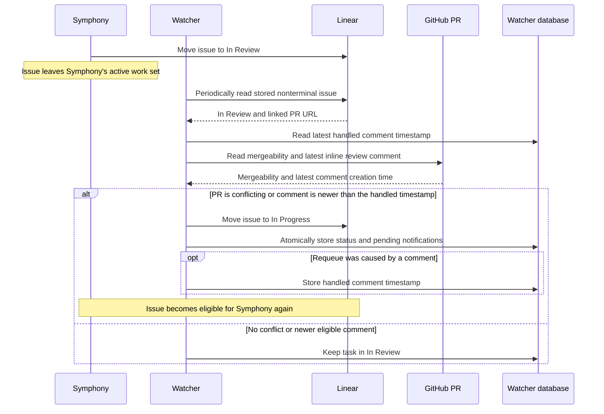

# Architecture

Orchestrators runs two long-lived processes:

- **Symphony runner:** starts and supervises one Symphony instance per enabled project.
- **Watcher:** observes Symphony, reconciles tasks with Linear and GitHub, and exposes their state in
  Slack.

A task can leave Symphony's active work set while remaining nonterminal in the watcher. This is
what allows review tracking to continue after Symphony stops working on an issue.

## System overview


Symphony, Linear, and GitHub are polled. Slack interactions arrive through Socket Mode; GitHub
comments do not use a webhook.

## Source boundaries

The watcher source is organized by responsibility:

- `domain/` contains business data grouped by concept (`task`, `snapshot`, `service`, watcher
  events, and provider value models). Domain modules do not call external services or persistence.
- `integrations/<provider>/` translates each external Linear, GitHub, or Slack API into domain
  values. Provider clients, queries, and feature operations remain together under that boundary.
- `persistence/` owns database schema and storage operations.
- `slack/` owns Slack presentation, commands, interactions, and Slack-specific parsing.
- `watcher/` orchestrates polling, enrichment, reconciliation, and notification delivery.
- `entrypoints/` wires runtime dependencies and starts the long-lived processes.

Imports should name the domain concept they consume instead of depending on a shared catch-all type
module. Provider-specific parsing belongs with that provider, while API communication remains in
`integrations/`.

Large orchestration modules use narrow entry-point facades. `slack/app.ts` exposes app creation,
status actions, and event publishing implemented in separate modules. Watcher polling, event
processing, and Linear reconciliation are likewise separated so retry control, event side effects,
and reconciliation policy can be reviewed independently. Persistence keeps the `WatcherStore`
facade while delegating snapshot storage, task-event storage, and temporary take-PR requests to
focused modules.

Feature-heavy areas use the same pattern without adding a dependency-injection layer:

- Linear issue reads and take-PR issue creation live in separate integration modules; the provider
  `index.ts` only exposes their public operations.
- Slack take-PR handling separates mention intake, interactive actions, validation, and Block Kit
  rendering. Mention commands and general Slack views are also grouped by user-facing operation.
- `WatcherStore` remains the concrete persistence API while delegating task, status, assignee,
  snapshot, and event operations to focused modules.
- Watcher startup and one polling iteration are separate functions, and runtime configuration keeps
  resolved types, validation, and value construction separate.

Dependencies continue to be passed explicitly through function arguments and constructors already
present in the application. There is intentionally no service container, generic repository
interface, or runtime dependency-injection framework.

## Tracking model

See [Symphony workflows](workflows.md) for profile selection and per-instance
`WORKFLOW.md` configuration.

### Symphony active work

Each instance selects issues from the active states in its `WORKFLOW.md`. The watcher polls
`/api/v1/state` every three seconds and compares the response with the previous snapshot.

A snapshot change emits an event when a task:

- appears or disappears;
- changes execution state; or
- becomes blocked or starts retrying.

The watcher enriches events with authoritative Linear state and, when needed, GitHub pull-request
metadata.

For a running task, Slack publishing works as follows:

- The first observation creates a Timeline card and its first transition entry.
- The card refreshes at most once every 15 seconds with the latest Symphony activity and a bounded
  local Git diff summary.
- Git inspection includes untracked text additions and limits command time, output, file count, and
  bytes read.
- Activity refreshes update the card in place without creating audit events or thread replies.
- Synthetic outage snapshots preserve the last successfully observed activity.

### Watcher tracked tasks

Publishing a task to Slack persists it in the watcher database. The record remains after the task
leaves Symphony's active snapshot.

Every 30 seconds, the watcher reconciles stored nonterminal tasks with Linear. This keeps states
such as `In Review` visible even when they are outside Symphony's active work set.

Effective terminal state is determined in this order:

1. `tracker.terminal_states` in the instance's `WORKFLOW.md` is terminal.
2. `tracker.active_states` is nonterminal.
3. All other states use their Linear state type.

Terminal tasks are excluded from later reconciliation. At startup, persisted terminal tasks are
reconciled once so that removing an override can restore Linear's current state type.

When `watcher.pullRequestStatusSync` is enabled, periodic maintenance separately inspects linked
pull requests. An unmerged `CLOSED` observation moves the issue to the configured status; `MERGED`
observations are left to Linear's GitHub automation. Pending and completed lifecycle events make a
failed Linear or Slack publication retryable and keep previously synchronized terminal tasks
eligible long enough to observe a reopen, replacement, or later Linear state change. The deployment
model remains a single watcher process, so this event log provides polling idempotency rather than
distributed coordination.

## Snapshot processing

Each watcher cycle processes observations in this order:

1. Retry pending status timelines, status hooks, and review notifications during scheduled
   maintenance.
2. Collect Symphony snapshots and compare them with the last persisted snapshots.
3. Enrich each changed task with Linear state, PR metadata, and its review-requeue decision.
4. Persist the task state and pending transition work, then create or update its Slack card and
   Timeline.
5. Apply an eligible review requeue and synchronize PR reactions.
6. Replace the persisted snapshots only after all changed tasks succeed.
7. Refresh running-task activity, then reconcile stored tasks that did not produce a snapshot
   event.

Persisting task state before Slack delivery allows a failed delivery to resume. Delaying snapshot
replacement until all events succeed makes the same snapshot difference available to the next poll
after a failure. Periodic reconciliation sends its updates through the same Slack publishing and
review-requeue path.

## Polling and API calls

| Trigger              |                   Typical interval | External work                                                 |
| -------------------- | ---------------------------------: | ------------------------------------------------------------- |
| Symphony observation |                          3 seconds | Read each enabled instance's local observability API          |
| Snapshot change      | Event-driven after a 3-second poll | Read Linear; query the task's PR when needed                  |
| Periodic maintenance |                         30 seconds | Reconcile tasks; query PR status and comments when configured |
| Slack interaction    |                       Event-driven | Update Linear when needed, then update the Slack task card    |

### GitHub access

- GitHub is queried during event enrichment when PR data is needed.
- Tasks in the configured review status are queried during 30-second reconciliation, even if their
  Symphony snapshot has not changed.
- Access uses `gh pr view` and `gh api`.
- Supported reactions on the PR body are mirrored to the Slack thread parent. The watcher syncs
  presence only, not counts or authors, and removes only its own stale reactions.

### Linear workflow state cache

At startup, the watcher loads each enabled Linear team's workflow states to validate configuration
and caches name-to-ID mappings for one hour.

- Active and terminal state names are validated against the instance's Linear team. Symphony's
  compatibility names `Merging`, `Closed`, and `Cancelled` are also accepted.
- Manual Slack status changes resolve the issue and its team's current states before updating.
- Automated review requeues reuse the issue UUID from event enrichment and the cached target state
  ID, so the normal path sends only the update mutation.
- Cache expiration is lazy. The next automated requeue reloads state metadata.
- A transient cached mutation failure keeps the cache.
- A non-transient failure invalidates the team cache and returns the original error. A later poll
  reloads state metadata; there is no immediate retry.

## Review requeue lifecycle

Review requeueing is enabled with:

```ts
reviewComment: {
  inReviewStatus: "In Review",
  inProgressStatus: "In Progress",
  reviewReadyDelayMs: 10 * 60 * 1_000,
  symphonyGitHubLogins: ["your-symphony-account"],
}
```

`reviewReadyDelayMs` controls how long a pull request revision must remain ready before assignees
are mentioned. It defaults to 10 minutes and accepts zero for notification on the next observation.

For tasks in `inReviewStatus`, the watcher reads PR mergeability and the latest eligible inline
review comment. A comment is eligible when it:

- belongs to a current, unresolved review thread;
- was not written by the PR author or an account in `symphonyGitHubLogins`; and
- is newer than the last handled comment timestamp in `task_events`.

Comments in resolved or outdated threads are ignored, including comments added after resolution. A
resolved thread becomes eligible again if it is reopened and is not outdated.



The PR is requeued when GitHub reports `CONFLICTING` or an eligible comment is newer than the
stored timestamp. This captures feedback added before the next watcher poll and prevents an already
handled comment from requeueing the task again.

### Accepted recovery gaps and limits

This internal tool assumes a single watcher process and intentionally avoids distributed recovery
machinery:

- After Linear accepts a requeue, the local status, handled timestamp, and pending notifications
  are stored in one transaction.
- A process exit between the Linear update and local transaction can allow the same comment to
  requeue a later review cycle.
- The cursor stores a timestamp, not comment IDs. Comments with the same GitHub `createdAt` are one
  feedback boundary.
- At most the first 100 review threads returned by GitHub are examined.
- Without a handled cursor, the first current unresolved comment can trigger a requeue even if it
  predates the current review cycle.

These limits avoid comment-ID lifecycle tracking, pagination, and per-review baseline state.

## Persistence and recovery

The watcher database stores:

- the latest Symphony snapshots used for diffing;
- tracked tasks and their current known Linear status;
- Slack parent-message identifiers;
- watcher events and review requeues; and
- pending delivery state for recoverable Slack notifications.

Persisted state allows review tracking and delivery retries to resume after a watcher restart. No
polling or requeue handling occurs while the watcher is stopped.
